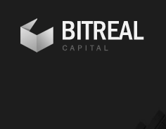

# README

The BITREAL coin supports the special AIF of BITREAL Capital with the ERC-20 Token Standard (https://theethereum.wiki/w/index.php/ERC20_Token_Standard) based on smart contracts of the Ethereum network (https://ethereum.org).

# Introduction
The BITREAL coin is covered by commercial real estate and uses the ERC-20 token standard of the Ethereum network. The use of this standard ensures that the most widely used token technology is in place today, reducing the total lifecycle management burden from the initial coin offering (ICO) and purchase to completion and sale of each token as much as possible.

The structure of the BITREAL coin consists of the following components:
* BITREALCoin.sol
* BITREALCoinICOCampaign.sol
* BITREALCoinAssetManagement.sol
* BITREALCoinDisburse.sol
* LinearTokenVault.sol
* MiniMeToken.sol

# BITREALCoin.sol
This smart contract reflects the characteristics of the BITREAL Coin. To achieve the highest possible security standards, this is derived from the widely used MiniMeToken of the ERC20 token standard.

# BITREALCoinICOCampaign.sol
To manage and control the BITREAL coin generation during the ICO runtime.

# BITREALCoinAssetManagement.sol
This smart contract manages the real estate invested by the BITREAL Coin.

# BITREALCoinDisburse.sol
Controls the distribution of dividends during the term to the holders of the respective BITREAL Coins.

# LinearTokenVault.sol
This smart contract holds and manages the BITREAL coins distributed across the team.

# MiniMeToken.sol
Property of this smart contract is the use of the ERC-20 token standard.

# Documentation
For additional information and Whitepaper please visit https://bitrealcapital.com/en/
